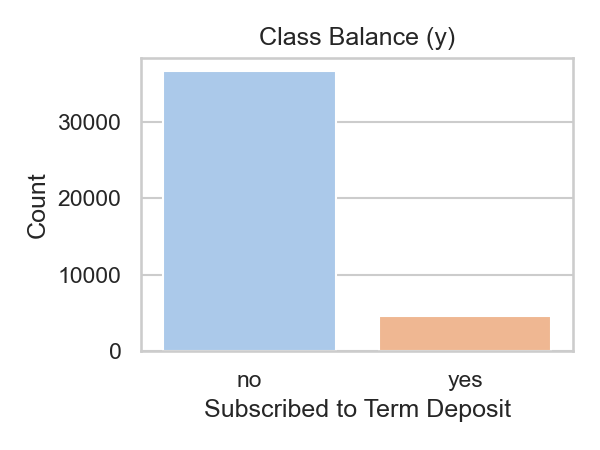
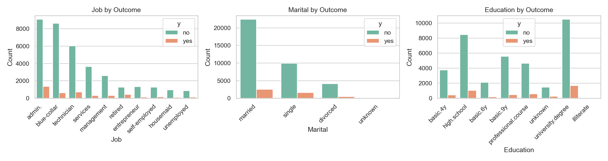
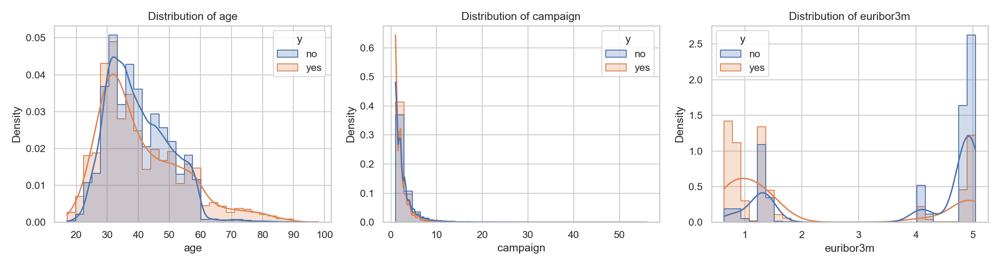
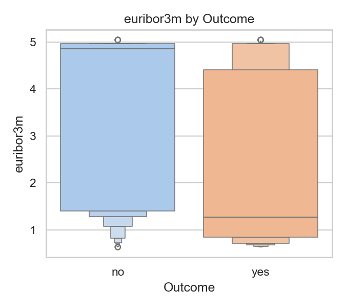
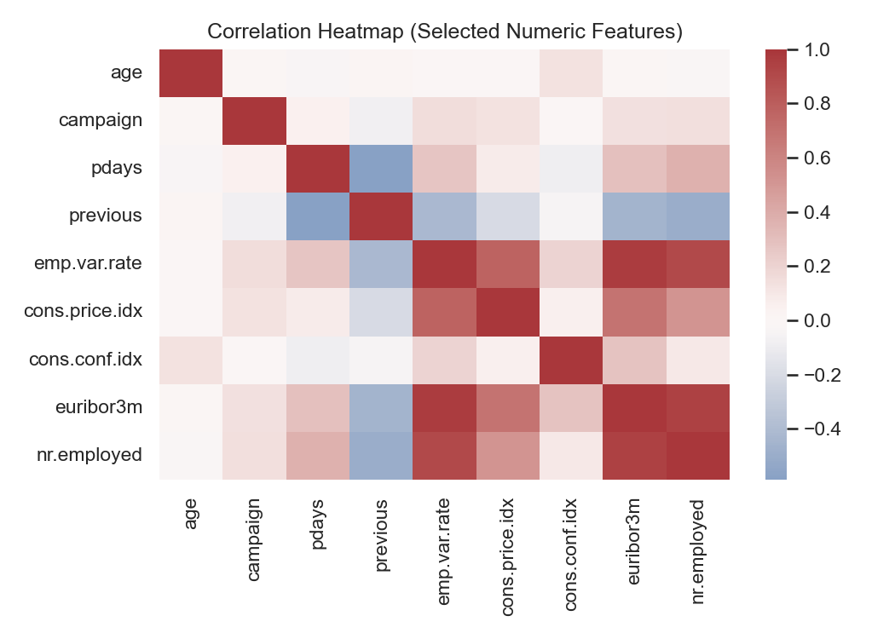

# Practical Application III: Comparing Classifiers

This project compares four classifiers on the UCI Bank Marketing dataset: k-Nearest Neighbors, Logistic Regression, Decision Tree, and SVM.

## Business Problem
Identify customers likely to subscribe to a term deposit during a telemarketing campaign, enabling better prioritization of outreach.

## Dataset
- Source: UCI Machine Learning Repository (Portuguese bank marketing campaigns)
- File used: data/bank-additional-full.csv (semicolon-separated)
- Target: y ("yes"/"no")
- Note: The "duration" feature is excluded for realistic modeling to avoid leakage (per the dataset documentation). A benchmark including duration is optionally shown for reference.

## Methods
- EDA with seaborn/matplotlib
- Preprocessing via ColumnTransformer (imputation, one-hot encode, scale)
- Models: LogisticRegression, KNN, DecisionTree, SVC
- Stratified train/test split, 5-fold cross-validation
- Primary metric: ROC AUC (class imbalance ~11% positives); also report F1 and accuracy. PR AUC can be considered as a complementary metric.
- Hyperparameter tuning with GridSearchCV

## Findings (summary)
- Logistic Regression and SVM typically perform best on ROC AUC with proper preprocessing; trees can be competitive after tuning.
- Economic indicators (e.g., euribor3m), contact and campaign history features contribute meaningfully. Avoid using duration for deployment.
- Threshold tuning is needed for operational precision/recall trade-offs.

## Visualizations
The notebook saves plots to the figs/ folder. Key visuals:

- Class balance:
  
- Top categorical counts by outcome:
  
- Numeric distributions (age, campaign, euribor3m):
  
- euribor3m by outcome:
  
- Correlation heatmap (selected numeric):
  

## Repository Structure
- prompt_III.ipynb — main analysis notebook
- data/ — dataset files
- CRISP-DM-BANK.pdf — reference paper
- figs/ — saved figures generated by the notebook

## How to Run
1. Create a virtual environment (optional but recommended)
2. Install dependencies:
   pip install -U pandas numpy scikit-learn seaborn matplotlib jupyter
3. Launch Jupyter and open the notebook:
   jupyter notebook prompt_III.ipynb

## Next Steps
- Calibrate probabilities (e.g., CalibratedClassifierCV)
- Explore class weighting or resampling
- Tune decision thresholds to business costs
- Consider additional features and campaign-level modeling

